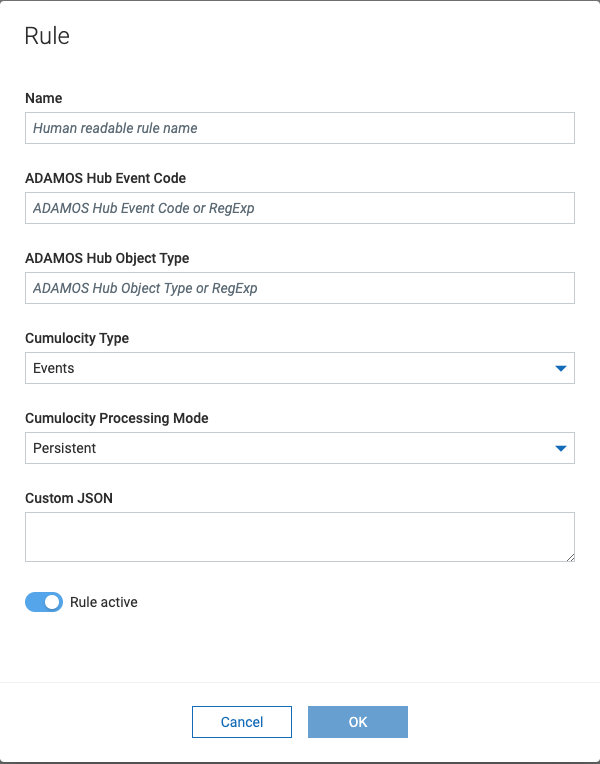
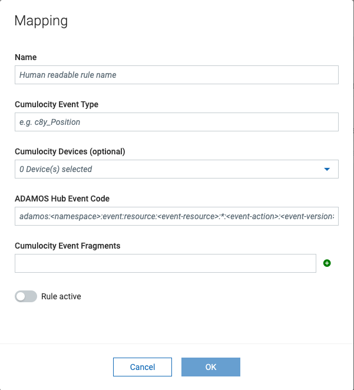

# Cumulocity IoT ADAMOS Hub Connector (c8y-adamos-hub-connector)
The Cumulocity IoT ADAMOS Hub Connector provides 2-way synchronization of devices between ADAMOS Hub Services and a Cumulocity IoT Tenant. The following functionality is provided:

* Synchronization of devices between the ADAMOS Hub MDM Service and the Cumulocity IoT Inventory
* Mapping of ADAMOS Hub events into Cumulocity IoT Events
* Mapping of Cumulocity IoT events into ADAMOS Hub Events

The Cumulocity IoT ADAMOS Hub Connector is based on version 1.0 of the ADAMOS Hub Services.

## Installation

* Order the Cumulocity IoT ADAMOS Hub Connector from the ADAMOS Store
    * Dev Store: https://adamos-store.dev/product/cumulocity-adamos-hub-connector/details
    * Production Store: TODO
* Fetch the latest release from the Releases page (https://github.com/SoftwareAG/c8y-adamos-hub-connector/releases). 
* Install the microservice (*hubconnector-X.Y.Z.zip*) on your Cumulocity IoT tenant.
* Install the UI as an application plugin (*ax-ui-hubconnector-microfrontend.zip*) into Cumulocity IoT Administration
    * Create Adminstration clone, select *Overrule subscribed application* to replace the standard Administration application with your clone
    * If you are on Cumulocity IoT 10.15, open the Administration application with *?beta=true* appended to the URL
    * Click on your newly created Adminstration clone in the application list. Select Plugins tab.
    * Click on install plugins. Select and install ADAMOS Hub Connector plugin (*ax-ui-hubconnector-microfrontend.zip*)
    * Open the Administration clone. It might be necessary to clear your browser cache.
* Create or modify a global role with the *Adamos hub* Admin / Read / Create / Update permission added. Assign the role to anybody who should be able to access the administration UI.

## Settings

* From the Navigator, expand ADAMOS Hub, and select settings:
    * Synchronization - configures which operations (create, update, delete) should be synchronized in which direction
    * OAuth2 - ADAMOS Hub credentials that the Hub Connector should use. Are provided when order of application from ADAMOS Store is fulfilled.
    * AMQP - ADAMOS Hub credentials to receive events from the ADAMOS Hub. re provided when order of application from ADAMOS Store is fulfilled.
    * Environment - select whether to use the development or production instance of ADAMOS Hub

## User Documentation

### Device Synchronization

The core functionality of ADAMOS Hub Connector is to synchronize devices between ADAMOS Hub and Cumulocity IoT. This is the basis for other functionality like event mappings.

* The device list by default shows all devices available on the Cumulocity IoT tenant. For each of these devices that are also available on ADAMOS Hub, the status column shows the ADAMOS Hub id. All other devices show a disconnected status. They can be connected using the link button in the rightmost column. This will give the option to link the Cumulocity IoT device to an existing ADAMOS Hub device or to create a new device in ADAMOS Hub. When a device is disconnected from ADAMOS Hub, only the link between the device in Cumulocity IoT and ADAMOS Hub is severed but they are not deleted.
* When switching the device liszt to ADAMOS Hub devices, all devices in ADAMOS Hub regardless of whether they are available in the Cumulocity IoT tenant are shown. Here it is possible to link ADAMOS Hub devices to new or existing Cumulocity IoT devices and the unlink them again.

### Events from Hub

ADAMOS Hub publishes events via AMQP. The ADAMOS Hub Connector can subscribe to these events and map them into Cumulocity IoT measurements, events, and alarms. This mapping is controlled by mapping rules:

* Name - a human-readable name
* ADAMOS Hub Event - the type of the event on ADAMOS Hub (documented here https://enablement.adamos.com/adamos-hub/fuer-entwickler/developer-handbook/introduction/). May include regular expressions.
* ADAMOS Hub Event ObjectType - the type of object emitting the event on ADAMOS Hub. May include regular expressions.
* Cumulocity Type - whether to map the events into measurments, events, or alarms.
* Cumulocity Processing Mode - more details see here https://cumulocity.com/api/10.14.0/#section/REST-implementation/HTTP-usage
* Custom JSON - static JSON structure to add to all mapped measurements, events, and alarms

### Events to Hub

Events produced in Cumulocity IoT can also be sent to ADAMOS Hub to update the state of equipment there. the target events must be events supported by the ADAMOS Hub Event Service (https://enablement.adamos.com/adamos-hub/fuer-entwickler/developer-handbook/event-service/):

* Name - a human-readable name
* Cumulocity event type - the type of Cumulocity IoT event to map into an ADAMOS Hub Event
* Cumulocity devices (optional) - select zero, one, or multiple devices for which this rule should be applied. If no devices are selected, the rule applies for all devices
* ADAMOS Hub Event Code - the type of the event on ADAMOS Hub (documented here https://enablement.adamos.com/adamos-hub/fuer-entwickler/developer-handbook/introduction/). May include regular expressions.
* Cumulocity event fragments - one or multiple fragments from the Cumulocity IoT event that should be mapped into the attributes of the ADAMOS Hub Event. No mapping takes place so the fragments should consist of attributeTypeId, value, and state (optional). If a selected fragment points to an array, the array elements will be included individually in the attributes array (the fragment array will be "flattened").
 
## API Documentation
The OpenAPI specification of the Connector API is listed here:
https://github.com/SoftwareAG/c8y-adamos-hub-connector/blob/main/hubconnector-oas.json

_________________

These tools are provided as-is and without warranty or support. They do not constitute part of the Software AG product suite. Users are free to use, fork and modify them, subject to the license agreement. While Software AG welcomes contributions, we cannot guarantee to include every contribution in the master project.
