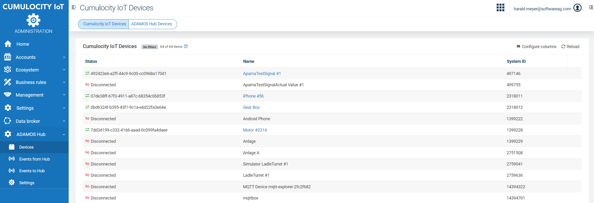

# Cumulocity IoT ADAMOS Hub Connector (c8y-adamos-hub-connector)
The Cumulocity IoT ADAMOS Hub Connector provides 2-way synchronization of devices between ADAMOS Hub Services and a Cumulocity IoT Tenant. The following functionality is provided:

* Synchronization between the ADAMOS Hub MDM Services and the Cumulocity IoT Inventory
* Fetching of product images from the ADAMOS Hub Catalog Service

The Cumulocity IoT ADAMOS Hub Connector is based on version 1.0 of the ADAMOS Hub Services.

## Installation

* Order the Cumulocity IoT ADAMOS Hub Connector from the ADAMOS Store
    * Dev Store: https://adamos-store.dev/product/cumulocity-adamos-hub-connector/details
    * Production Store: TODO
* Fetch the latest release from the Releases page (https://github.com/SoftwareAG/c8y-adamos-hub-connector/releases). Note that there are different releases depending on whether you want to use the Development or Production instances of the ADAMOS Hub.
* Install the UI (*hubconnector-UI-1.0.0.zip*) and the microservice (*hubconnector-1.0.0.zip*) on your Cumulocity IoT tenant.
* Create or modify a global role with the *Adamos hub* Admin permission added. Assign the role to anybody who should be able to access the administration UI.
* Open ADAMOS Hub Connector Application from the application switcher and configure global settings*:
    * Synchronization - configures which operations (create, update, delete) should be synchronized in which direction
    * OAuth2 - ADAMOS Hub credentials that the Hub Connector should use. Are provided when order of application from ADAMOS Store is fulfilled.

## User Documentation

* Import Hub Device - Click on *Import Hub Device* a list of Hub devices not yet synchronized will be shown and a device can be selected to be imported into Cumulocity IoT.
* Add C8Y Device to ADAMOS Hub - Click on the plus sign next to the device name in the list to synchronize the Cumulocity IoT device to the ADAMOS Hub.

## API Documentation
The OpenAPI specification of the Connector API is listed here:
https://github.com/SoftwareAG/c8y-adamos-hub-connector/blob/main/hubconnector-oas.json

_________________

These tools are provided as-is and without warranty or support. They do not constitute part of the Software AG product suite. Users are free to use, fork and modify them, subject to the license agreement. While Software AG welcomes contributions, we cannot guarantee to include every contribution in the master project.
